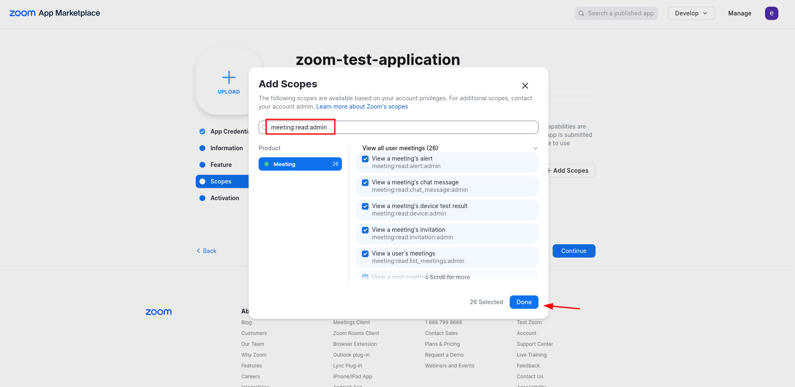
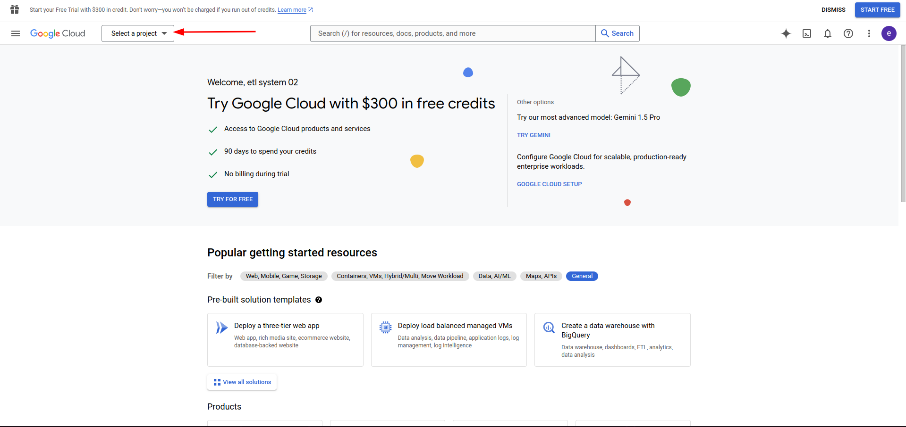

# Third Party Meetings Integration

## Overview

This application integrates meetings and events from Zoom, Microsoft Teams, and Google Meet into ERPNext. It allows users to manage and view meetings from these platforms within the ERPNext ecosystem, streamlining the process of event management.

## Features

- **Integration with Zoom**: Fetch and display meetings associated with a Zoom account.
- **Integration with Microsoft Teams**: Retrieve and show meetings scheduled in Microsoft Teams.
- **Integration with Google Meet**: Access and manage Google Meet events.

## Prerequisites

Before you begin, ensure you have the following:

- An instance of ERPNext set up and running.
- API credentials for Zoom, Microsoft Teams, and Google Meet.

## Setup Instructions

### 1. Zoom Integration

To integrate Zoom meetings, follow these steps:

1. **Create a Zoom App**:

   - Go to the [Zoom App Marketplace](https://marketplace.zoom.us/).
   - Click on "Develop".
     

   - Then Click on "Build App".
     

   - A pop up will appear, to agree to the terms and conditions, click on "Accept".
     

   - After that another pop up will appear, asking that what kind of app you want to build, click on "Server to Server OAuth App".
     

   - Then click create. Another pop up will appear, asking for the app name, add the name and click on "Create".
     

   - This will create an app, and you will be redirected to the app dashboard.
     

   - Then in the left sidebar, click on "Information" tab. And fill the Company Name, Developer Name and Developer Email and Click "Continue".
     

   - Then in "Scopes" Tab, click on "Add Scope".
     

   - Then in Search Scope, search for "meeting:read:admin" and select all scopes and click "Done".
     

   - Then in "Activation" Tab, click on "Activate your app" Button.
     

   - This will activate your app.
     

2. **Obtain Credentials**:

   - **Account ID**: Find your account ID in the Zoom admin dashboard.
   - **Client ID**: Generated when you create the app.
   - **Client Secret**: Generated when you create the app.

### 2. Google Meet Integration

To integrate Google Meet:

1. **Create a Google Cloud Project**:

   - Go to the [Google Cloud Console](https://console.cloud.google.com/).
   - Create a new project by clicking on "Select a project" dropdown in the top left corner and click on "New Project".
     
     
   - Then give the project a name, Location can be default "No Organization" and click on "Create".
     

   - It will take to the home page and a notificaiton will appear on the top right corner, click on "Select Project".
     

   - This will take you to the home page of the project.
     

   - From the left sidebar, click on "API & Services" and then click on "Enable APIs and Services".
     

   - In the search bar, search for "Google Calendar API" and click Enter for search.
     

   - It will show the Google Calendar API, click on "Google Calendar API".
     

   - Then click on "Enable" button.
     

   - This will enable the Google Calendar API. Now click on "Create Credentials" button.
     

   - A new page will appear, to create Credentials, By default in "Select an Api" the "Google Calendar API" will be selected, for the next question "What data will you be accessing?" select "Application Data" and click on "Next".
     

   - It will ask you to create a Service Account, give the Service Account a name and click on "Done".
     

   - Then go the 'Credentials' page, you will see a email id added to the "Service Account" section, you will see a email id click on the email id.
     

   - Here You will see the email id of the service Account, copy the email id for later use.
     

   - Now, click on "Keys" tab.
     

   - Then click on "Add Key" button and select "Create New Key".
     

   - This will create a new key, now click on "Create" button.
     

   - This will download the key file, keep it safe as it will be used to authenticate the API calls.

   - Now go to your Google Calendar, you will see My Calendars section, click on the calendar you want to fetch the events from. (It should be the one with google account name). And Select 'Settings & sharing' from three dots menu
     

   - Here go to the "Share with Specific people or groups" and click add people and groups button
     

   - Then paste the email id of the service account in the Add Email or Name field and click on the email id it will be added and then click on "Send" button.
     

   - This will share the calendar with the service account email id.

## How to Use

## Troubleshooting

- Ensure that your API credentials are correctly configured.

## Contribution

Feel free to contribute to this project by submitting issues or pull requests.

## License

This project is licensed under the MIT License.
